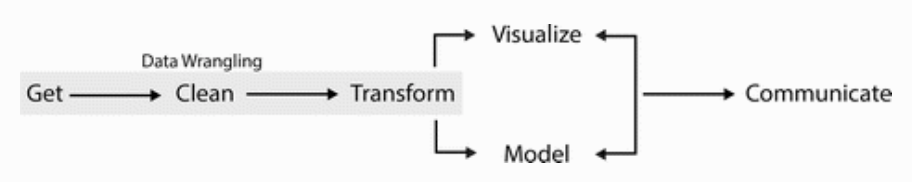

[Foundations of Data Science for High School, Winter 2021]
Foundations of Data Science for High School
==========================================
author: Dr. Jeho Park
date: November 20, 2021
autosize: true


Git Setup
==========
__We will be using RStudio's Git/GitHub feature__

Instructor RStudio -------------------------------------------------> Student RStudio

Instructor RStudio --- push --> [GitHub Repo] --- pull --> Student RStudio


Today's Topics
==============
- R data objects: vector, data frame, factor, function
- Working with Data:  
  - Built-in Data  
  - Data Import
- Data Wrangling
  - Data Transformation with `dplyr`: filter, arrange, select, mutate, group_by, summarise 
- R's Logical Operators
- Piping operator %>% 
- Missing values

Basic R Objects: Vectors
========================================================
Vectors are array objects of the __same type__ data elements.


```r
class(a)
```

```r
class(A)
```

```r
b <- c(a,A) # concatenation
```

```r
print(b)
```

```r
class(b) # why?
```

Basic R Objects: Vectors (cont.)
========================================================
R has five basic or “atomic” classes of objects: 
* character
* numeric (real numbers) 
* integer
* complex
* logical (True/False)

A vector contains a set of data in any one of the atomic classes.

Basic R Objects: Data frames
========================================================
__Data frames are used for storing data tables as a collection of vectors of equal length.__  
  
__A data frame is a basic data object for this course!__


```r
n <- c(2, 3, 5) # a vector 
s <- c("aa", "bb", "cc") # a vector
b <- c(TRUE, FALSE, TRUE) # a vector 
df <- data.frame(n, s, b) # a data frame
df
mtcars # a built-in (attached) data frame
mtcars$mpg # notice this $ operator
```

Basic R Objects: Data frames (cont.)
========================================================
__Data frames are used for storing data tables__  
__It is a column-wide collection of vectors of equal length__. 

```r
df1 <- data.frame(y1=rnorm(1000),y2=rnorm(1000), y3=rnorm(1000))
head(df1) # display first few lines of data
names(df1) # display column names
summary(df1) # output depends on the data types
plot(df1)
hist(df1$y1)
```


```r
df2 <- read.table("https://s3.amazonaws.com/assets.datacamp.com/blog_assets/test.txt", header = FALSE)
df2
```

R Objects: Factor
========================================================
* Factors are a special compound object used to represent __categorical data__ such as gender, social class, etc.
* Factors have 'levels' attribute. They may be nominal or ordinal.
* Remember the types of variables from Day 2? Factors are the R's implementation of quantitative variables.

```r
v <- c("a","b","c","c","b","d","f")
x <- factor(v) # turn the character vector into a factor object
z <- factor(v, ordered = TRUE) # ordered factor
x
z
table(x)
```

R Objects: Functions
=============================

```r
fun <- function(a,b) {
  a*b
}

fun   
fun(2,3) # a function call
```

Variable and Object Naming Convention
===================
Find all that can be a variable (or object) name in R from the following:


```r
(1) 4wheelDrive   

(2) four_wheel_drive  

(3) fourWheelDrive  

(4) !my4wheeldrive  

(5) _4wheelDrive  

(6) Four.Wheel.Drive  
```

What is Data Wrangling?
======================================
<div align="center">
  
</div>

Source: Wrangling Wild Horses in the Mountains of Montana (Director: Kristopher Rey-Talley) | Short Film Showcase | National Geographic Channel on Youtube (https://youtu.be/vkBtEe-lieU?t=131) | clip from 2:11 to 3:11

What is Data Wrangling?
=============================================
Data wrangling is the process of obtaining, cleaning, reshaping and transforming raw (and messy) data into a usable form of processed (and tidy) data.

  
Source: "Data Wrangling with R" by Bradley C. Boehmke | Use R! Series

Working with Data
========================================================
* Built-in datasets and basic data import
* Quick data exploration with summary
* Hands-on exercise

Built-in Datasets 
========================================================
- R's datasets package has some built in datasets that we will be using.

```r
data() # this will bring up a document, R data sets
```

- Let's look at CO2 datasets. The CO2 data frame has 84 rows and 5 columns of data from an experiment on the cold tolerance of the grass species Echinochloa crus-galli.

```r
help(CO2) # see what the dataset is about
CO2 # display all the contents of the data frame, CO2
```

__Notice there's no CO2 dataframe in the Environment pane__

Data Import
========================================================
__Data file import is very easy with RStudio__

Follow the instructor and import "auto.csv" file!

Click-click-click-done!

Session II
==============
## Data Transformation: 
- Pick observations by their values (filter()).
- Reorder the rows (arrange()).
- Pick variables by their names (select()).
- Create new variables with functions of existing variables (mutate()).
- Collapse many values down to a single summary (summarise()).
- Group by group operations (group_by())
  
  
## Essentials for Data Transformation:
- Boolean Operator in R
- Piping, Missing values, Summary functions


Data Transformation
====================
Let's use `nycflights13` dataset for our examples and hands-on practice.

If you don't have the `nycflights13` package, install it.


```r
library(nycflights13)
library(tidyverse)
```

We will be using `flights` data frame for our study. Try `?flights` to find out the details of the data set.

In the next sections, we will learn data manipulation functions from `dplyr` package.

Data Transformation: Filter rows with filter()
=============
Let's create a new data frame, `jan1`, containing only the flights on January 1st.


```r
jan1 <- filter(flights, month == 1, day == 1)
```

Notice assignment operator (<-) and comparison operator (==)

Comparison and Logical Operators in R
=================================

Comparison Operators

| Operator | Description              |
|----------|--------------------------|
| <        | Less than                |
| >        | Greater than             |
| <=       | Less than or equal to    |
| >=       | Greater than or equal to |
| ==       | Equal to                 |
| !=       | Not equal to             |

------------------
Logical Operators

| Operator | Description              |
|----------|--------------------------|
| !        | Logical NOT              |
| &        | Element-wise logical AND |
| &&       | Logical AND              |
| |         | Element-wise logical OR  |
| ||         | Logical OR               |
| xor(x,y) | Exclusive OR             |

TRUE or FALSE
===============

```r
# Logical Operators in R
5 < 2
(5 < 2) & (3 > 2)
(5 < 2) | (3 > 2)
5 %in% c(1,2,3,4,5)
is.na(c(1,2,NA,4,5))
```


```r
# vectorized (element-wise) operator
x <- c(TRUE, FALSE, FALSE)
y <- c(TRUE, TRUE, FALSE)
x & y   # returns a logical vector
x && y  # returns a Boolean value
```

Boolean Operators
=================


[Hands-On] Filter and Logical Operators
==============

1. Find all flights that departed in November or December.

1. Find all flights that weren’t delayed (on arrival or departure) by more than two hours

Missing Values and Comparison/Logical Operations
========================
It is important to remember that the results of any operations on rows with `NA` values will be unknown (NA) as well.


```r
NA > 5
#> [1] NA
10 == NA
#> [1] NA
NA + 10
#> [1] NA
NA / 2
#> [1] NA
```


Data Transformation: Arrange rows with arrange()
==================
__`arrange` sorts observations (rows) by a variable (column) in ascending order__


```r
temp <- arrange(flights, year, month, day)
```

[Hands-on] Arrange and find
=================

1. Sort `flights` to find the most delayed flights. Find the flights that left earliest.

1. Which flights traveled the farthest? Which traveled the shortest?

Data Transformation: Select columns with select()
==================
__`select` extract_ (subsets) only the variables (columns) that you choose__


```r
# Select columns by name
select(flights, year, month, day)

# Select all columns between year and day (inclusive)
select(flights, year:day)

# Select all columns except those from year to day (inclusive)
select(flights, -(year:day))
```

Helper Functions for Select
===========================
In real world datasets, a data frame may have hundreds or thousands of columns. And also in such cases, the column names may be coded with some pattern (e.g., TRD012021, TRD022021, etc.).

- `starts_with("abc")`: matches names that begin with “abc”.
- `ends_with("xyz")`: matches names that end with “xyz”.
- `contains("ijk")`: matches names that contain “ijk”.
- `matches("(.)\\1")`: selects variables that match a regular expression. This one matches any variables that contain repeated characters. You’ll learn more about regular expressions in strings.
- `num_range("x", 1:3)`: matches x1, x2 and x3.
- `everything()`: matches all variables (it could be "everything else" if used with a combination of other variables)

>> Try `??'Selection language'` from your console to open a help doc about selection helper functions.


[Hands-On] Let's do some exercise!
===============
1. Select `dep_time`, `sched_dep_time`, `dep_delay`, `arr_time`, `sched_arr_time`, and `arr_delay` from flights and save the subset as `flights_time`. (Brainstorm how you can do this.)

2. Arrange `flights_time` by `dep_delay` in descending order (i.e., arrange them from largest to smallest) and then by `arr_delay` in descending order. Save this sorted data frame back to `flights_time` 

3. Make an one-liner code for the two steps (#1 and #2 above). Use nested function calls. 

Piping using %>%
==========================================
- You can chain dplyr functions together using a special looking operator called a pipe operator: `%>%`
- The pipe operator feeds the resulting object into the 1st argument of the next function. 
- Keyboard shortcut is Shift-Cmd-M (for Mac) and ? (for Windows)

[Breakout] Nested calls vs. Piping
===================================================
__Discuss which code snippet is more readable: (1) nested function calls vs. (2) piping.__


```r
# Nested function calls
flights_time1 <- 
  arrange(
    select(flights, contains(c("dep_","arr_"))), 
    desc(dep_delay), desc(arr_delay)
  )
```


```r
# Piping
flights_time2 <- 
  flights %>%  
  select(contains(c("dep_","arr_"))) %>% 
  arrange(desc(dep_delay), desc(arr_delay))
```

When not to use pipes
=====================
- When your pipes are too long (In this case, it does not help code clarity or readability)
- When you have multiple inputs or outputs. (It is good for one data frame as an input.)
- When you have to use a directed graph with a complex dependency structure. (Pipes are essentially good for a step-by-step progress of code execution.)


Data Transformation: Add new variables with mutate()
==================
__`mutate` creates new variables based on some calculations using other variables__  
__The newly created variables (columns) are added to the end of the data frame.__


```r
starwars_mass <- 
  starwars %>% 
  select(name, mass) %>% 
  mutate(mass2 = mass * 2, mass2_squared = mass2 * mass2)
starwars_mass
```

- `transmute` creates a new data frame containing only the new variables.

```r
starwars_mass2 <- 
  starwars %>% 
  select(name, mass) %>% 
  transmute(mass2 = mass * 2, mass2_squared = mass2 * mass2)
starwars_mass2
```

Data Transformation: Grouped summaries with summarise() and group_by()
=======================
__`summarise` applies a summary function (e.g., mean, sum, etc.) and returns a result.__   


```r
flights %>% 
  summarise(delay = mean(dep_delay, na.rm = TRUE))
```

__Use `summarise` and `group_by` together to create grouped summaries__  

The following R code generates a data frame, `daily_dep_delay`, containing average daily departure delays.


```r
daily_dep_delay <- 
  flights %>% 
  group_by(year, month, day) %>% 
  summarise(delay = mean(dep_delay, na.rm = TRUE))
daily_dep_delay # Any issue?
```

(Discuss: *Why the NA's for delay?*)

Missing Values
================
__It is very important to correctly treat missing values in your datasets.__

__Especially, when you use aggregation functions (mean, sum, n, etc.) and if there’s any missing value in the input dataset, the output will be a missing value (NA)__


```r
x <- c(1, 2, 3, NA, 5)
sum(x)
```

Useful summary functions
==================
Summary functions return a single (aggregated) value. We have seen `sum()`, `mean()`, and `n()` for calculating sum, average, and count respectively.

__Measures of Location__

- `median()` is useful to find an observation at the middle when all the obs are sorted from smallest to largest.


```r
x <- c(10, 5, 2, 4, 3, 9, 6, 7, 8, 1, 0)
median(x)
```

__Measures of Spread__

- `sd()` (standard deviation) is useful to see how much the values of the observations are spread around the average

__Measures of Rank__

- `min()`, `quantile(x, 0.25)`, `max()` are useful to find minimum, quantile, and maximum respectively.

- `quantile(x, 0.25)`, will find a value of a vector, x, that is greater than 25% of the observations and less than 75% of the observations. We read it as 0.25-quantile which is the same meaning as 25th percentile. 

Session III
======================
For the rest of the workshop, you will be working on a couple of hands-on exercises. If you cannot finish them all in time, you are welcome to finish it after the workshop. A QCL staff can help you remotely and synchronously via Zoom or asynchronously via emails.

Hands-On Exercise 1 (Difficulty: low)

Hands-On Exercise 2 (Difficulty: medium-high)


Hands-On Exercise 1 (Difficulty: low)
========================================================
First, import "Births2015.csv" from GitHub as a data.frame `births2015` to answer the questions below:

1. What are the variables of `births2015` data.frame?
2. What is the total number of babies born in 2015?
3. How many babies were born on Wednesdays? (must use the pipe operator)
4. Which `date` had the least amount of babies born?

The Births2015 CSV file is at https://raw.githubusercontent.com/jehopark/data_wrangling_with_r_beginners/master/Births2015.csv

To import a CSV data file from the Internet:

```r
library(readr) # need this for read_csv
fileurl <- "https://raw.githubusercontent.com/jehopark/data_wrangling_with_r_beginners/master/Births2015.csv"
births2015 <- read_csv(fileurl) 
```


Hands-On Exercise 2 (Difficulty: medium-high) 
========================================================
## COVID-19 Cases in the U.S.

Create a barplot showing daily changes in the new COVID-19 cases in the US.

(1) Data can be found from The NY Times: Coronavirus in the US   
Here's the [report](https://www.nytimes.com/interactive/2020/us/coronavirus-us-cases.html) and [data description](https://www.nytimes.com/article/coronavirus-county-data-us.html)  
(2) Open the GitHub repository where they store the up-to-date datasets  
(3) Find the **raw** CSV file URL for U.S.State-Level Data (us-states.csv); copy the link address.
(4) Save the link address as fileurl variable.  
(5) Import us-states.csv to your R Environment and see what are the variable names  
(6) Group by `date` and then pipe the results to `summarise` to generate a new variable `sum_cases`; what is the summary function you want to use for summarise?  
(7) Create a new variable (column) `daily_cases` by mutating the `sum_cases` variable; what kind of mutation do you need here? For calculating the difference between two consecutive days, you want to use `lag` function. Try `lag(1:10, 1)` to see what it returns.  
(8-1) Use barplot to plot the `daily_cases` variable.
(8-2) If you are familiar with ggplot2, use geom_bar.

Exercise 2! (Solution skeleton)
========================================================
Create a barplot showing daily changes in the new COVID-19 cases in the US.


```r
library(readr) # need this for read_csv

fileurl <- " #_FILL-IN_# "
us_states <- read_csv(fileurl) # import CSV

data_covid <- us_states %>% 
  #_FILL-IN_# %>% # group_by
  #_FILL-IN_# %>%  # summarise
  #_FILL-IN_# # mutate and lag
barplot( #_FILL-IN_# ) # just a simple barplot with one argument 

# or use ggplot2 ## We will learn ggplot2 in Visualization Workshop
require(ggplot2)
p <- data_covid %>% 
        ggplot(aes(x=date, y=daily_cases)) + 
        geom_bar(stat="identity", color="orange")
p
```
  
### Extra Hands-On: Add the seven day moving average line to the bar plot.

Session IV
==========
Exercise!


LAB5
=============
- 5.2.4: #1
- 5.3.1 #1, #3
- 5.4.1 #4
- 5.5.2 #5
- 5.6.7 #5


