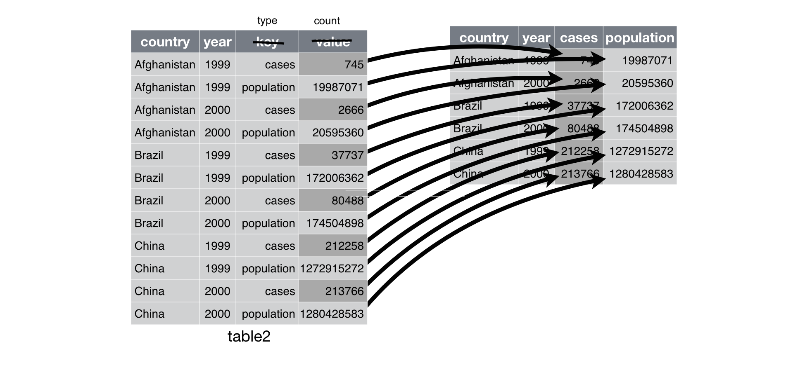

[Foundations of Data Science for High School, Winter 2021]
Foundations of Data Science for High School
==========================
author: Dr. Jeho Park
date: 12/4/2021
autosize: true


Quick Review
==============

Week 1: Data Visualization (ggplot2 패키지)  
Week 2: Data Wrangling (dplyr 패키지)   
Week 3: Exploratory Data Analysis (탐색적 데이터 분석)  
Week 4: Working with Different Data Types (readr 패키지)

Today's Topics
==============
- Data Import
- Parsing a Numeric Vector
- Parsing a Character Vector
- Character Encoding and Parsing
- Parsing Date Related Vector
- Parsing a File
- Writing to a File
- Tibbles vs Data Frames
- Tidy Data
- Vectorized operations
- Pivoting data
- Making tidy data

Data Import
==========
- readr package: read_csv, read_tsv, read_fsf, etc.
- read_csv options
- Parsing a vector

Essential read_csv options
========
- skip
- comments
- missing values
- Other things to be careful when you read a CSV file

[Hands-On] Import a CSV file
=================
1. From your RStudio, do "Pull Branches" to download 
2. Import the file and 
3. See summary of the data frame

Parsing a vector with parse_*() functions
================
__Recall that a vector is an atomic data structure that allows only one type of data in it__

Run the following examples:


```r
str(parse_logical(c("TRUE", "FALSE", "NA")))
str(parse_integer(c("1", "2", "3")))
str(parse_date(c("2010-01-01", "1979-10-14")))
```

Q: what does`str()` do?


```r
x <- parse_integer(c("123", "345", "abc", "123.45"))
x
```

Basic R Objects: Vectors
========================================================
Vectors are array objects of the __same type__ data elements.


```r
a <- 1
class(a)
  
A <- "2"
class(A)
```

```r
b <- c(a,A) # concatenation creates a vector

print(b)

class(b) # why?
```

Basic R Objects: Vectors (cont.)
========================================================
R has five basic or “atomic” classes of objects: 
* character
* numeric (real numbers) 
* integer
* complex
* logical (True/False)

A vector contains a set of data in any one of the atomic classes.

Parsing a Numeric Vector
==============
Some possible issues with numbers:

1. People write decimal numbers differently in different parts of the world. See https://en.wikipedia.org/wiki/Decimal_separator.
2. Numbers often contain “grouping” characters to make them easier to read, like “1,000,000”, and these grouping characters vary around the world.  
3. Numbers are often surrounded by other characters that provide some context, like “$1000” or “10%”.  

Parsing a Numeric Vector: 
Issue #1 Decimal Mark and Issue #2 Grouping Mark Issue
==============
__Use `locale`__


```r
parse_number("1,234.56")

parse_number("1.234,56", locale = locale(decimal_mark = ",")) # Not what we want! How can we solve this issue?
```

Try `?locale` and `default_locale()` from your console. Which arguments are the number related arguments?

Solve the issue above with locale function.

Parsing a Numeric Vector: Issue #3 Non Numeric Character Issue
==============
__Use `parse_number()`__


```r
parse_number("$100.25")

parse_number("20%")

parse_number("It cost $123.45")
```

Parsing a String Vector
==========


```r
charToRaw("Korea")
```

Each *hexadecimal* number represents a byte of information:
- 4B --- encoding ---> "K"
- 6F --- encoding ---> "o"

__What? A byte? Hexadecimal?__ 

Number System: Binary, Decimal, Octal, and Hexadecimal
=========================
- Digital Units: Bits, Bytes, and Words
- Human Number System: Binary (base 2 이진수), Octal (base 8 팔진수), Decimal (base 10 십진수), and Hexadecimal (base 16 십육진수)

Q: How many different numbers one bit can represent?  
Q: How many different numbers two bits can represent?  
....  
Q: How many different different numbers four bits can represent?  
Q: How many different different numbers a byte can represent?


```r
2^8 
```


Character Encoding
=========================
English characters could be represented with 8 bits: ASCII   
How about Korean characters? So many combination of 초성, 중성, 종성: 조합형, 완성형 ---> Unicode

__Unicode Standard__  
UTF: Universal Coded Character Set + Transformation Format (Unicode Transmission Format)

UTF-8 uses 1 byte to 4 bytes to represent a character.  
UTF-8 can encode just about every character used by humans today, as well as many extra symbols (like emoji!).


```r
2^(4*8) # 4 bytes can represent this many different characters
```

Parsing Characters
===============

```r
s1 <- "El Ni\xf1o was particularly bad this year"
s2 <- "\x82\xb1\x82\xf1\x82\xc9\x82\xbf\x82\xcd"
s3 <- "\xed\x95\x9c\xea\xb8\x80\xec\x9d\x80\x20\xeb\xa9\x8b\xec\xa0\xb8"


s1
s2
s3
```

The cases for s1 and s2 do not mean that the strings were broken or error. You need to change the encoding to manually match the character code.


```r
parse_character(s1, locale = locale(encoding = "Latin1"))

parse_character(s2, locale = locale(encoding = "Shift-JIS"))

parse_character(s3, locale = locale(encoding = "UTF-8"))
```

Parsing Characters (Cont.)
===============
If you did not know the encoding, you may use `guess_encoding` to guess its encoding method 


```r
guess_encoding(charToRaw(s1))
guess_encoding(charToRaw(s2))
guess_encoding(charToRaw(s3))
```

Regarding character encoding, read this article: https://www.joelonsoftware.com/2003/10/08/the-absolute-minimum-every-software-developer-absolutely-positively-must-know-about-unicode-and-character-sets-no-excuses/

Parsing Dates, date-times, and times
==============

- `parse_datetime()` expects an ISO8601 date-time. For more information about ISO8601 format, please read https://ko.wikipedia.org/wiki/ISO_8601.
- `parse_date()` expects a four digit year, a - or /, the month, a - or /, then the day like "2010-10-01"
- `parse_time()` expects the hour, :, minutes, optionally : and seconds, and an optional am/pm specifier like "01:10 am"


Date-Time Format and Code
===============
__Year__  
`%Y` (4 digits); 2021  
`%y` (2 digits); 00-69 -> 2000-2069, 70-99 -> 1970-1999.  

__Month__  
`%m` (2 digits); 07  
`%b` (abbreviated name, like “Jan”).  
`%B` (full name, “January”).  

__Day__  
`%d` (2 digits); 01  
`%e` (optional leading space).  

-------

__Time__  
`%H` 0-23 hour; 17 (= 5 pm)  
`%I` 0-12, must be used with %p.  
`%p` AM/PM indicator.  
`%M` minutes.  
`%S` integer seconds.  
`%OS` real seconds.  
`%Z` Time zone (as name, e.g. America/Chicago).   
`%z` (as offset from UTC, e.g. +0800).   

__Non-digits__   
`%.` skips one non-digit character.   
`%*` skips any number of non-digits.   

[Hands-On] Guess the year, month and day
=================

`parse_date("01/02/12", "%m/%d/%y")`   

`parse_date("01/02/12", "%d/%m/%y")`   

`parse_date("01/02/12", "%y/%m/%d")`   

Parsing a File
==============

The readr package automatically guesses the type of each column by parsing the first 1000 lines:


```r
guess_parser("2010-10-01")

guess_parser("15:01")

guess_parser(c("TRUE", "FALSE"))

guess_parser(c("1", "5", "9"))

guess_parser(c("12,352,561"))
```

Test the following readr problem:


```r
challenge <- read_csv(readr_example("challenge.csv"))
head(challenge)
tail(challenge)
```

What is the issue here? and How can you solve this?

Parsing a File (Cont)
==============

```r
challenge <- read_csv(
  readr_example("challenge.csv"), 
  col_types = cols(
    x = col_double(),
    y = col_date()
  )
)
head(challenge)
tail(challenge)
```

Writing to a File
=============
When you write your well parsed data using custom options to a CSV file, don't forget that the information is no longer preserved. 

This means that when you read the CSV file back, you have to specify how to read each column again in your script.


```r
write_csv(challenge, "./challenge2.csv") # 
challenge2 <- read_csv("challenge2.csv")
```

Tibbles
========

>> Tibbles are data frames, but they contain more information and have additional characteristics than the old data frames. 

Let's see iris data frame


```r
iris
class(iris) # data.frame
```

Create a tibble from a data.frame


```r
iris_tibble <- as_tibble(iris)
class(iris_tibble) # tbl_df
```

Differences of a Tibble from a Data Frame
===========
Printing (console output) 


```r
class(nycflights13::flights) # tibble
nycflights13::flights %>% 
 print(n = 10)
# print(n = 10, width = Inf) 
```


Tidy Data: A Data Structure All Data Scientists Want
===========
- Tidy Data
- Vectorized operations
- Pivoting data
- Making tidy data

Tidy Data
============
The number of TB cases documented by the World Health Organization in Afghanistan, Brazil, and China between 1999 and 2000. 


```r
table1
table2
table3
table4a
table4b
```

Tidy Data Rules
==========
There are three interrelated rules which make a dataset tidy:

- Each variable must have its own column. (변수마다 자신의 열이 있어야 한다.)

- Each observation must have its own row. (관측객체마다 자신의 행이 있어야 한다.)

- Each value must have its own cell. (관측값마다 자신의 쎌이 있어야 한다.)


Why Tidy Data is Better and Recommended?
==============

1. There’s a general advantage to picking one consistent way of storing data. (일관된 데이터 구조를 저장할 때의 장점이 있음)

2. There’s a specific advantage to placing variables in columns because it allows R’s vectorised nature to shine. (변수가 열에 배치될때 R의 벡터화된 계산을 하기가 용이해 진다.)

[Side Note] What is a __vectorized operation__?

Vectorized Operations
===============

Given two numeric vectors, `x = (1, 2, 3, 4)` and `y = (5, 6, 7, 8)`,


```r
x <- 1:4
y <- 5:8 
```


Calculate `z`, an element-wise sum of x and y, using a `for` loop:

```r
z <- 0 # initialize z
for (i in 1:4) {
  z[i] = x[i] + y[i] # z[3] = x[3] + y[3] 
}
z
```

Do the same thing using R's vectorized operation:


```r
z1 <- x + y # vectorized operation
z1
```


Examples of Easy Tidy Data Manipulations
===========


```r
table1 %>% 
  mutate(rate = cases / population * 10000) 
```


```r
# Compute cases per year
table1 %>% 
  count(year, wt = cases)
```


```r
# Visualise changes over time
# library(ggplot2)
ggplot(table1, aes(year, cases)) + 
  geom_line(aes(group = country), colour = "grey50") + 
  geom_point(aes(colour = country))
```

Pivoting
========
__Most real world data are untidy__

__The first thing you need to do is to figure out what the variables and observations are in your dataset.__

__And then the next step is to resolve one of two common problems:__

- One variable might be spread across multiple columns.

- One observation might be scattered across multiple rows.

>> To fix these problems, you’ll need the two most important functions in tidyr: `pivot_longer()` and `pivot_wider()`.

Pivot Longer
===========

__Issue: Some of the column names are values, not variable names__

Let's look at the `table4a`:


```r
table4a
```

(1) Find the column names that are values  
(2) Come up with a column name to hold the values used as column names   
(3) Name a new column to move the observation values under.   
(4) Use pivot_longer to rearrange the columns and row values.   


```r
table4a_long <- 
  table4a %>% 
    pivot_longer(c(`1999`, `2000`), names_to = "year", values_to = "cases")
table4a_long # display the result
```

This will make the tibble longer. So, the function name, `pivot_longer`

Pivot Longer
===========


[Hands-On] Making data tidy
=================
Make table4b tidy using pivot_longer


```r
table4b_long <- 
  table4b %>% 
    pivot_longer(c(`1999`, `2000`), names_to = "year", values_to = "population")
table4b_long
```

Pivot Wider
===========
Let's look at the table2 case.


```r
table2
```

__Issue: one of the columns (`type`) holds an observation whose values are scattered across multiple rows.__

(1) Find the column that take variable names from. (e.g., type)  
(2) Find the column that take values from. (e.g., count)  

Pivot Wider
============


```r
table2 %>%
    pivot_wider(names_from = type, values_from = count)
```




Lab 4
===========
Exercise 11.2.2: #1

Exercise 11.3.5: #7 (할수 있는데 까지\^\^)  

Data Project and Presentation
================
(1)   데이터 프로젝트 정하고 데이터 찾기 (Research)

(2)   제안서 작성하기 (Communication)

(3)   데이터 모으기 (Data Collection)

(4)   데이터 정리하기 (Data Wrangling)

(5)   데이터 시각화 (Data Visualization)와 데이터 분석 (Analysis)을 통하여 결과 도출하기  

(6)   결과를 리포트로 만들기 (Documenting) R Markdown Template 사용

(7)   결과를 10분 정도의 프레젠테이션으로 만들고 발표하기 (Communication) RPubs 사용


